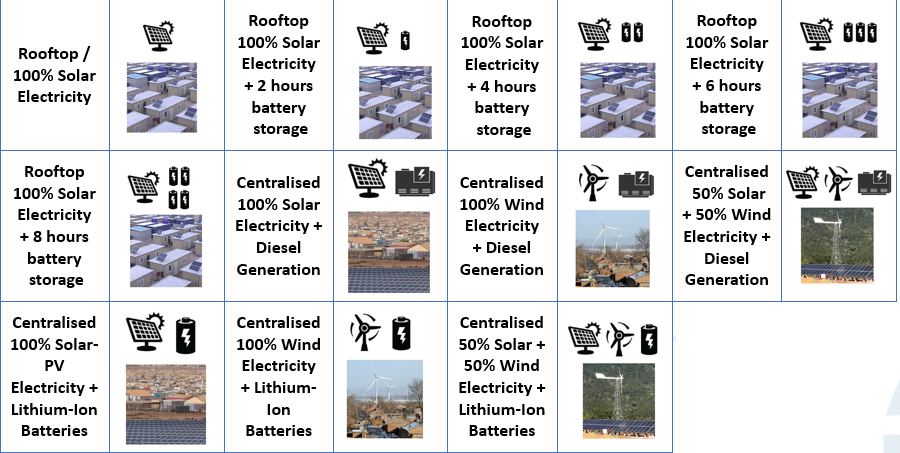
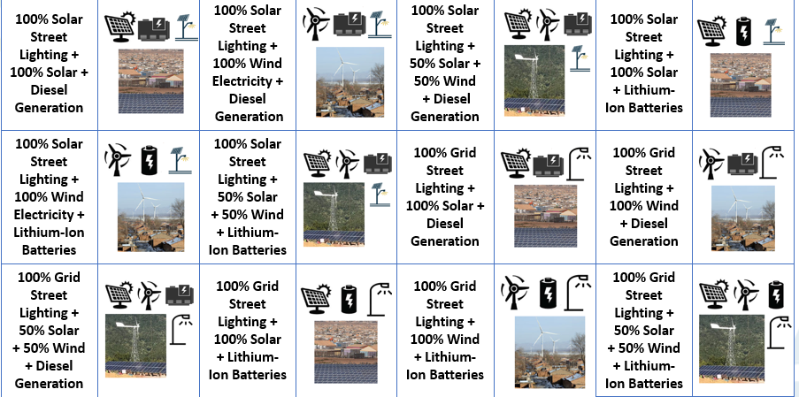

3. Energy Supply Calculations
-----------------------------

**Linking Energy Demands to Energy Supply Sources**

The Renewable Energy Recommendations Tool works by generating a total demand
side profile for different types of energy use divided into:

-   Cooking energy use requirements for camp families/households for use in
    cooking stoves.

-   Centralised electricity energy use requirements for camp community
    buildings/uses, camp management/NGO’s, and streetlighting, as well as water
    pump requirements.

-   Decentralised electricity energy use requirements for camp
    families/households, including lighting, mobile phone, and electric
    appliance utilisation.

After calculating profiles for one or more of these demands (depending on user
interest) the tool will first calculate the baseline demand based on the current
energy infrastructure in the camp, as entered in the tool by the user. This
provides for a baseline current energy situation assessment.

Subsequently, the tool seeks to calculate how the demands can be met using
different supply options. In the current version a total of 16 cooking stove
options are evaluated (Figure 2), a total of 11 options for camp
family/household electricity supply (Figure 3), and a total of 12 options for
centralised electricity use for camp community buildings, main buildings,
streetlighting and water pumping needs (Figure 4).

**Figure 2**. Cooking Stove Options Compared in V1 of RERT

**Figure 3.** Household/Family Electricity Supply Options Compared in V1 of RERT

**Figure 4.** Camp Community/Institutions Electricity Supply Options Compared in
V1 of RERT

**Translation of cooking fuel demands into a load profile**

The calculation of cooking fuel demand and supply was described in section 2
under the cooking energy use section. In brief the demands are based on the
population in the camp, the stove distribution, the type of fuels used in the
stoves, and use duration, stove efficiency and capacity parameters. The
calculation results in the aggregate fuel use in the camp. To calculate new fuel
supply needs the tool estimates what the requirements are for different type of
stove options (16 in total as mentioned above. Based on the assumption that each
family/household will utilise one stove type as a simplification, with multiple
fuel options.

**Translation of household/family electricity demands into a load profile**

To evaluate the electricity supply options for households/families the
electricity use needs to be translated from energy usage in kWh into a power
demand profile requirement in watts per hour, $$E_{j,t}^{d}$$. An aggregate
approach is utilised based on which total electricity use is superimposed on the
same electricity use pattern by category.

Three different categories are utilised:

-   Low appliance household/Family electricity use pattern, who do not utilise
    any appliances beyond mobile phones and lighting

-   Medium appliance household/Family electricity use pattern, who own and use a
    television and/or an electric radio.

-   High appliance household/Family (with a business) electricity use pattern,
    who own and use the above as well as an electric washing machine or a small
    food fridge or an electric fan or combinations of the three.

The divisions of electric appliances are based on the ownership questions posed
to the user. For each of the three household/family categories a different
electricity use load profile is applied and superimposed on total electricity
use. The profile determination builds upon the data in Blodgett et al. (2017)
with combined energy use surveys and measured data from SteamaCo mini-grids of
176 households in Kenya.[20] Load profile data is also available in Hartvigsson
and Ahlgren (2018) but here it is based on only survey data to elicitate time of
use information from 47 households in Tanzania, which is less reliable.[19] The
analysis in Blodgett et al. (2017) yields three user types, “night users” that
utilise their electricity mostly from 18:00 to 24:00, “day users” that utilise
their electricity mostly from 08:00 to 20:00, and “mixed users” that utilise
about 60% of their electricity in the evening and 40% during the day (see Figure
3 below). Day users are mostly businesses and mixed users are mostly mixed
business/households.[20]

In the simulation the low and medium appliance household/family users the
profile from Blodgett et al. (2017)[20] for day user groups is applied, whilst
for the high appliance household/family users the mixed user group profile is
applied.

**Figure 5.** Load profiles for night users (left), day users (middle), and
mixed users (right).

Figure adapted from Blodgett et al. (2017) [20]

**Translation of community/institutional electricity use into a load profile**

Similar to the households/family’s evaluation, the community/institutional
electricity use needs to be translated from energy usage in kWh into a power
demand profile requirement in watts per hour, $$E_{j,t}^{d}$$. To this end an
aggregate approach is utilised based on different types of energy uses that are
distributed over hourly slots across the day. The estimations are carried out by
informed assumptions that can be adjusted by the tool user as required. The
following standard assumption are made:

-   **Water pumping energy use**, distributed from 07:00 in the morning until
    the end of the evening at 23:00.

-   **Building Heating energy use**, distributed from 00:00 at night until 05:00
    in the morning.

-   **Building Cooling**, distributed from 14:00 in the afternoon until 01:00 in
    the morning.

-   **Street Lighting**, varying by energy access tier from 19:00 until 21:00,
    23:00 or later in the night.

-   **Community Cooking**, distributed from 08:00 to 10:00 in the morning, 13:00
    to 15:00 in the afternoon, and 19:00 to 21:00 in the evening.

Note that in case buildings are not assigned to have heating or cooling by the
user, or if no community cooking takes place, these values will amount to zero
in the calculations.

**Energy Supply – Electricity for Household/Family and Institutional/Community
needs**

The nameplate capacity, $$C$$, required to provide electricity supply $$E^{l}$$
per year was calculated for fuel stock based generation options based on the
facility lifetime $$t = 1,2,\ldots l$$, the capacity factor of the power
generation unit, $$f$$, and the degradation $$\sigma$$ of the annual capacity
factor, using:

$$C_{j} = \frac{E_{j}^{l}}{(f_{j,t} - \sigma_{j,t}) 8760}$$ (10)

Parameters for electricity supply options were taken from Kis et al. (2018).[29]
In case of intermittent wind and solar-PV sources a different approach was taken
to establish the required capacity. First, an hourly profile was generated using
the Merra-2 Global dataset using the renewables ninja tool.[^2] In case of solar
a zero tracking system was assumed with a system loss or performance ratio,
$$\upsilon,\$$estimated at an average of 80% based on real-life evaluations from
tens of thousands of existing solar systems from the literature.[29] Second, a
lithium-ion battery supply option is added where relevant, in order to meet the
availability needs for the electricity supply in the evening.

[^2]: <https://www.renewables.ninja/>

Third, the generation source is scaled in terms of capacity to match the
respective supply point output needs to meet demands. The scaling is done based
on a three step procedure:

1.  The maximum kWh among hourly loads of demand across the entire year is
    selected,

2.  The value is multiplied by a factor, so as to minimize the lack of supply on
    sunless or windless days.

    1.  The selected factor for combined large scale (centralised) battery plus
        solar and/or wind system is selected at 1.2, to further oversize the
        system slightly and enable more constant power supply.

    2.  The selected factor for household/family solar-PV is set to 0.2, in case
        of solar-PV plus 2 hours of batteries it is set to 0.4, for solar-PV + 4
        hours of batteries it is set to 0.6, and for solar-PV plus 6 and 8 hours
        of battery it is set to 1. The scaling is selected to be closer to
        average (instead of maximum loads) to optimise costs, and gradually
        increase with battery systems included, as without batteries oversizing
        the solar-PV system is on average not helpful in case of sun-less days.

3.  The result value is divided for each generation type (solar, wind) by the
    maximum average hourly supply load in kWh provided by 1 kW of capacity,
    localised for the particular camp from the hourly profile using the
    renewables ninja tool.

The end result of this procedure is the number of kW of solar-PV or wind power
generation that is required to meet demand loads in aggregate. In case of
households/family needs the total generation can be divided by the number of
families to obtain per household capacity requirement.

In case of scenario’s where solar and/or wind generation is complemented with
diesel generation, the diesel generation is scaled to meet the missing maximum
load per hour. Thereby all demands can be met at all time.

In case of scenario’s of combined battery systems with centralised solar and/or
wind generation the capacity of the battery systems is set equivalent to the
generation capacity, and subsequently scaled by a factor 1.5 for
community/institutional use, and a factor 2 for household/family use.

Battery capacity for household/families with solar-PV plus battery is based on
the average evening time capacity requirement to meet demand from 18:00 plus
additional hours (2 hours for the 2 hours of battery scenario until 20:00 4
hours for the 4 hour battery scenarios, and so forth).