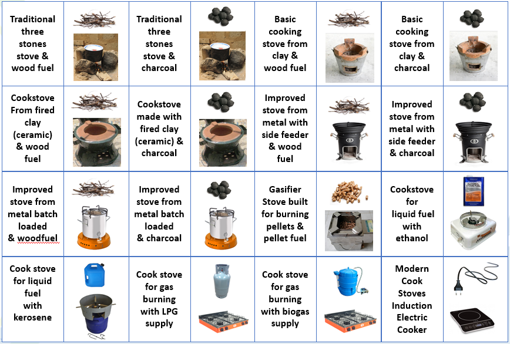
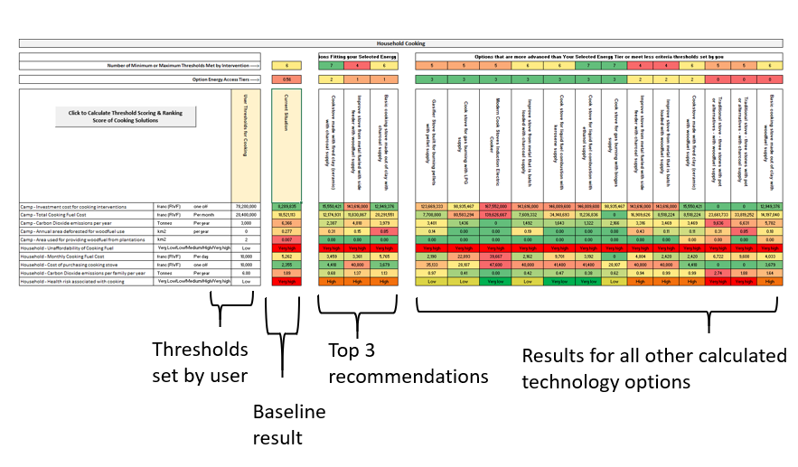
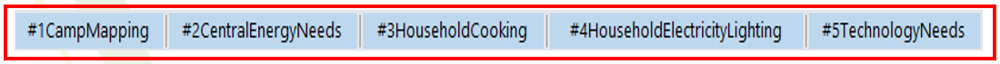
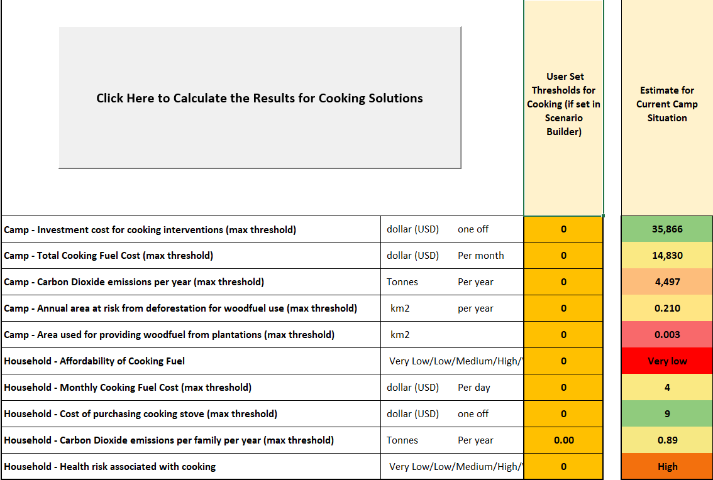
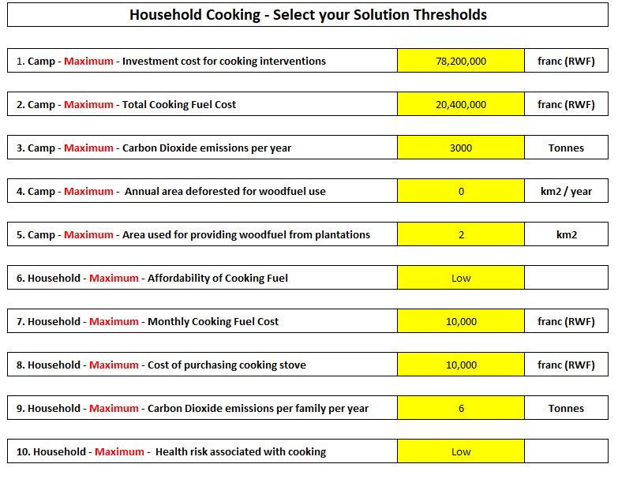
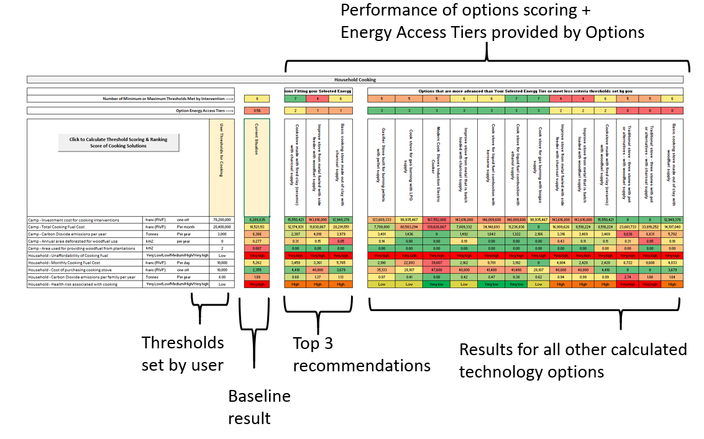

**Humanitarian Engineering for Energy for Displacement (HEED)**

# User Guide

**This is the HEED-RER tool user guide.** It is designed to provide an
accessible step-wise explanation for users on how to navigate the Excel Tool
spreadsheet.

<https://github.com/heedproject/rert> Version 1.2

>   Developed by: Rembrandt Koppelaar (Scene Connect)
>   Reviewed by: Jonathan Nixon (Coventry University)

## Tool use background

**The Humanitarian Engineering and Energy for Displacement (HEED) project aims
to understand the energy needs of forcibly displaced people to increase access
to safe, sustainable and affordable energy.**

**The HEED Renewable Energy Recommendations tool (HEED-RERT) for Camps:**

The first version (v1) of the tool was built by Scene Connect with support from
Coventry University and Practical Action between June 2018 and August 2019.

It aims **to provide technology recommendations based on
energy-economic-environment-health performance indicators** to provide support
for **how best to increase energy access** in refugee camps and improve
sustainability for i) **Cooking Energy, ii) Household Lighting and Electricity,
iii) Community/Camp central Lighting and Electricity.**

Users engage with an **Excel spreadsheet** where they answer questions to
describe the population of the camp, as well as the camp energy infrastructure
and energy use of families therein. They can also enter technical data for
particular renewable energy and cooking options. This allows the **user to
localise the results into the local context** as much as possible.

Results are **presented in the form of an indicator dashboard** where different
**technology options can be compared** with their performance indicator scoring.

1. It is recommended for each camp (or part of a camp) **to save the spreadsheet
with a new name as** its own self-contained version. To this end information can
be filled in on the overview tab in the sheet.

2. **The tool has been built with Excel 2018 and Excel 2019 versions**. It is
not backwards compatible with older versions at this time. Please use recent
versions of Microsoft Excel to use it.

3. **Feel free to modify and adjust the tool for your own purposes.** HEED-RERT
is built on Open Source principles

  
## Five Steps in HEED-RER Tool Usage

### Cooking Stove & Fuel Combinations *currently* comparable

### Household Lighting & Electricity options *currently* comparable in RERT v1

### Camp community / infrastructure energy *currently* comparable in RERT v1 

### Dashboard Result: Energy Technologies Compared on Indicators

### The Tool Identifies the Top 3 Best Scoring Options

  
## Using the tool

### Step 1 – Opening the Spreadsheet

**You need to enable “macro’s” when opening the spreadsheet when prompted
otherwise the results cannot be calculated.**

**For Help about this see the Microsoft Office Documentation here:**  
<https://support.office.com/en-us/article/enable-or-disable-macros-in-office-files-12b036fd-d140-4e74-b45e-16fed1a7e5c6>

### Step 2 – Fill in Overview – START HERE - tab

-   Fill this in to keep track of saved versions

-   Fill this in with country, camp name and which *currency* to use in the
    calculations

-   Select if you want to look only at i) cooking energy use, ii) at household
    electricity and lighting, iii) community/central lighting & electricity, or iv) all three of these

### Step 3 – Select Tool Modes

Select here if you are a technical user or a regular user. If you select the
technical user option additional spreadsheet tabs will be unlocked and made
visible:

-   Calc_Energy_Demand – containing energy demand calculations

-   Calc_Energy_Supply – containing demand-supply matching calculations

-   Calculation_KPIs – containing the calculations for performance indicators

### Step 4 - Guide to Provide Camp Information – where

To create an *accurate baseline of the energy situation in the Entire Camp*, you
need to answer close to 100 questions. These are divided in five main areas
(spreadsheet tabs):

-   \#1CampMapping, lists 9 questions about the number of people living in the
    camp, how many households operate businesses, its geography and the
    availability of vacant space,

-   \#2CentralEnergyNeeds, lists 20 questions about camp buildings, the source
    of electricity and heat, the camp’s food centres, water supply, and street
    lights.

-   \#3HouseholdCooking, lists 10 questions about cooking stoves and fuel use

-   \#4 HouseholdElectricityLighting, lists 27 questions about use of mobile
    phones, lighting options available, and electrical appliances.

### Step 5 - Guide to provide Camp Information - How

There are two types of questions to fill in for each camp

-   Multiple choice (yellow fields) with a selection drop down list:

-   Open questions (blue fields) where you need to fill in a quantity or a name

In some cases you may be prompted that you have filled in an answer that falls
outside of the range that is possible (for example 12 out of 10 is not
possible). If you fill in more or less than 10 when the totals should sum up to
10, you will be prompted to make sure as few errors as possible are entered.

### Step 6 – Calculate Results to obtain a Baseline

The results are calculated in the “results” tab separately for each type of
energy use:

1.  Cooking Energy,

2.  Household Lighting and Electricity,

3.  Community Lighting and Electricity.

After you have filled in the answers to the tool questions for the first time,
you can go to the results section and click on the calculate buttons.

**Buttons for calculating results:**

### Step 7 – Read the Baseline Performance

Baseline Performance Of Current Camp Situation

1.  Cost 35,866 USD if existing stoves were to be bought again

2.  Cost 14,830 USD to buy stove fuel per month

3.  4,497 tonnes CO2 emissions per year from cooking stoves in camp

And so forth for all indicators

### Step 8 – Set Energy Access Tier to Achieve

In the tab “Scenario Builder” you can set the Energy Access Tiers for Cooking,
Lighting, Street Lighting, Electricity and Heating that the recommendations need
to provide for:

The impact is that the 3 main recommended solutions will be selected within the
desired tier of energy access (e.g. if selecting tier 1 the recommendations will
be tier 1 options)

### Step 9 – What are Energy Access Tiers?

The Energy Access Tiers framework was setup by ESMAP (Energy Sector Management
Assistance Programme) to provide a common approach to understand the energy
access for different types of energy use. It contains tables that outline under
which conditions people or families achieve energy access levels ranging from 0
to 5 (see table below for the different type of indices).

More details can be found here: <https://www.esmap.org/node/55526>

### Step 10 – Set thresholds for indicators

In the tab “Scenario Builder” you can also set the minimum or maximum thresholds
that a solution needs to take into account. Each technology solution is weighted
on how many threshold option set by you it meets.

If there are 10 performance indicators (like for Cooking in v1) each cooking
stove + fuel solution can receive a score between 0 and 10 points

Thresholds can be compared and set relative to the baseline situation. For
example set a threshold that the cooking fuel cost per month should be at
maximum as high as the current expenditure, or that the carbon dioxide emissions
should be 50% lower in tonnage of CO2 per year.

Example Threshold Levels for Cooking Solutions to meet that are set by the user:

### Step 11 – Re-run results with your Energy Access Tier + Thresholds

**You can now re-run the results:**

1.  Cooking Energy,

2.  Household Lighting and Electricity,

3.  Community Lighting and Electricity.

### Step 12 – Interpret your Results

### Step 13 – Make specific changes in technology specifications

In addition to the camp questions, in the “Parameter-Listing tab there are
several hundred values that define the technologies compared in the model and
the calculations.

For example, if you have specific data for a specific stove you can adjust that
here, if you have specific information about the cost of solar, if you have data
on the energy use of appliances, and so forth.

Any value in green can be edited here directly and this will change the
calculations. Once editing a value here (or in the camp questions) you can run
the results again and get an updated insight in the performance of the
solutions.

  
## Overview of Models and Methods used

The user guide explained the usage process for the RER tool. More detailed
technical information can be found in the technical documentation made to
describe the calculations carried out in the tool. An overview of the
calculation steps is shown in the figure below.

Please see the technical documentation for more details
  
    
      
        
          
            
              