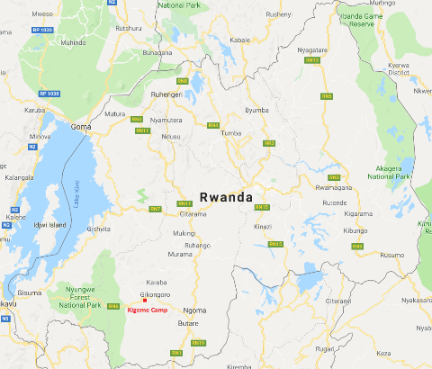
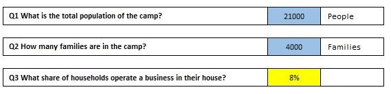
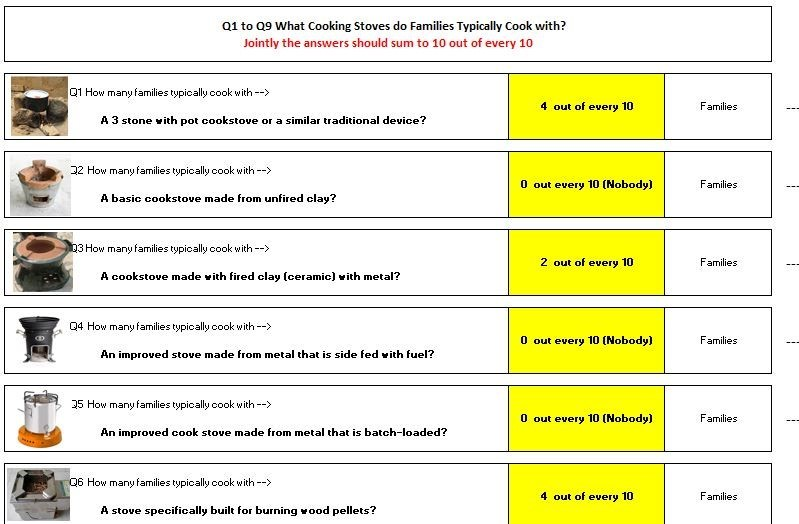

**Humanitarian Engineering for Energy for Displacement (HEED)**

##### Funded by the ESPRC Global Challenges Research Fund

### Renewable Energy Recommendations Tool (RERT) 

**Use Case:** Kigeme Camp Rwanda - Cooking Solutions Evaluation

**Authors:** Sandy Robinson (Scene), Rembrandt Koppelaar (Scene)

v.2.0 10th October 2019

**Overview** 
-------------

This document supports the Renewable Energy Recommendations Tool (RERT) produced as part of the Humanitarian Energy and Engineering for Development (HEED) research project. It provides a use case scenario to guide RERT users through the process of using the tool. The use case is particular to the assessment and recommendation of cook stove interventions at Kigeme Camp, Rwanda, and was undertaken in June 2019. When seeking to use the RERT, it is recommended that this case study is read in conjunction with the RERT User Guide.

### About Humanitarian Energy and Engineering for Development (HEED)

The HEED project is an innovative response to growing recognition of the need to improve access to energy, particularly renewable energy sources, for populations displaced by conflict and natural disasters. The focus of HEED is on the lived experiences in three refugee camps in Rwanda (Nyabiheke, Gihembe and Kigeme) and internally displaced persons (IDPs) forced to leave their homes as a result of the 2015 earthquake in Nepal.

### Renewable Energy Recommendations Tool (RERT)

The RERT was built by Scene Connect with support from Coventry University and Practical Action between June 2018 and April 2019. It aims to provide technology recommendations based on 23 performance indicators to increase energy access in refugee camps and improve sustainability for:

1.  Cooking Energy;

2.  Household Lighting and Electricity;

3.  Community/Camp central Lighting and Electricity.

Users engage with an Excel spreadsheet where they answer questions to describe the population of the camp and the social and economic situation, as well as the camp energy infrastructure and energy use of families therein. They can also enter technical data for particular renewable energy options.

**Use Case Scenario**
=====================

The purpose of providing a use case scenario is to give tool users a practical guide through a real-world example of using the tool in a humanitarian setting. The following evaluation details how to:

1.  **Input data** on current cookstove utilisation in Kigeme, Rwanda;

2.  **Interpret baseline energy use** outcomes from the tool, including economic
    and environmental analyses;

3.  **Define what level of energy access** has been achieved, based on the ESMAP
    multi-tier energy access matrices;

4.  **Understand tool recommendations** for cookstove interventions in a
    specific context;

5.  **Set boundary criteria** and alter specific parameters of the tool.

A special focus included to provide an understanding of which solutions could provide significant **climate change carbon emission impacts reductions,** as part of the improvements that could be achieved with shifts to better cooking solutions.

### Kigeme Refugee Camp

The Kigeme displaced people camp in Rwanda was setup in 2012 to address the influx of Congolese refugees into the country. As of early 2019 there are close to 21,000 residents and over 4,000 families living in the camp. The camp is situated in Nyamagabe district in South-West Rwanda, to the east of Nyungwe Forest National Park (see Figure 1). The area is hilly with land uses including forests, agriculture and host community settlements.

A number of programmes have been recently conducted in Kigeme, making it a particularly interesting use case in respect to cooking interventions. Alongside a cash assistance programme, which replace the provision of food and in-kind support with mobile phone accessible cash transfers, a number of new energy schemes have been deployed. This includes the introduction of an innovative cooking fuel solution which gives refugees the option to buy clean fuel (pellets) for use in improved cooking stoves with their cash allowances.

The improved cook stove solution scheme is being delivered in the camp by a Rwandan private sector social enterprise, [Inyenyeri](https://www.inyenyeri.com/our-solution), who produce environmentally sustainable fuel burning pellets and lease clean and highly efficient cook stoves to residents.

Data utilised in this use case was collected using existing data sources and via an integrated questionnaire deployed in Kigeme camp in 2018/19. Data was provided / collected by the HEED project team, with the support of UN humanitarian staff, Kigeme camp authorities and humanitarian energy researchers.

Use Case methodology
--------------------

This methodology is provided to guide users through using the RERT with real-world data and application to Kigeme Refugee Camp, Rwanda. The aim of this use case is to **understand the current (2019) cooking situation in Kigeme Camp and provide projections for viable cookstove interventions and their potential impacts.**

Stage 1: Baseline Data
======================

Baseline data was sourced and inserted into the RERT (see Figure 2), including:

-   Camp Population: **21,000**

-   No. of families in camp: **4,000**

-   Percentage share of households operating a business: **8%**

-   Landscape around the camp: **Evergreen Forest / Rainforest**

Figure 2 - Setting Baseline Data

The baseline cooking situation was estimated with the RERT using an integrated questionnaire approach (see Figure 3). The cooking modes primarily utilised in the camp include:

-   Three stone pot cookstoves or similar traditional devices using wood fuel
    (“Basic cookstoves”): **4 out of 10 families**

-   Cookstove made with fired clay (ceramic) with a metal holder using charcoal
    or briquette fuel (“Fired clay cookstoves): **2 out of 10 families**

-   Cookstove made for burning wood pellets (“Inyenyeri mimi-moto stove”) using
    wood pellets: **4 out of 10 families**

Further to this, the type and usage of fuels were estimated, including:

-   Basic cookstove: **Firewood - 9 out of 10 families / Charcoal - 1 out of 10
    families**

-   Fired clay cookstove: **Firewood - 6 out of 10 families / Charcoal - 4 out
    of 10 families**

-   Inyenyeri mimi-moto stove: **Wood pellet - 10 out of 10 families**

Finally, baseline income values, distribution and in-kind provision by camp authorities was set, including:

-   Low Income bracket: **23,600 RWF / month (US\$26) (70% of camp population)**

-   Medium Income bracket: **61,000 RWF / month (US\$66) (20% of camp
    population)**

-   High income bracket: **165,000 RWF / month (US\$178) (10% of camp
    population)**

Further to this a number of further variables are taken into account, including: monthly food cost per household; camp fuel provision and / or subsidisation; fuel production methods.

Figure 3 - Setting baseline cookstove use

Stage 2: Baseline Result
========================

The evaluation of the current state of cooking covered, **ten baseline performance indicators are output by the model,** of which the results are shown in Table 1 below in the column headed ‘Current Situation’. An aggregate energy access indicator for cooking for the camp is also shown.

Energy access is estimated by looking at the tier level - from 0 to 5 - for each cooking stove and fuel and their utilisation and generate an average value. The result for the entire camp is **an energy access level of 1.6 for cooking solutions**, given the prominence of burning wood pellet stoves that are already in use.

In terms of current cooking stove performance results, the **monthly total fuel expenditure was estimated at close to 1.6 million RWF**, versus a **capital cost of 5.5 million RWF in case all current cookstoves would need to be replaced** (asset value of the cookstoves used). Current **annual CO2 emissions for the camp were evaluated at 6,475 tonnes** for cooking which comes down to 1.33 tonnes per year per family. The utilisation of wood-fuel without provisioning of such fuels in a sustainable manner is evaluated by RERT to be associated with a
**forest area of 0.24 km2 that is at annual risk of deforestation**, given biomass needs to supply cooking fuels for all the 4,000 families in the camp. Finally, **health risks due to stove usage are still high** given the prominence of three stone post cookstoves, and to a lesser extent fired clay (ceramic) stoves.

Stage 3: Energy Intervention Recommendations
============================================

Recommendations are provided, based on the input baseline data and parameters relating to the cost, performance (capacity & utilisation), energy efficiency, fuel type and efficiency, emissions and energy tier. **Sixteen different cooking solutions are evaluated based on the current stove and fuel options in the tool, with the three most viable options recommended**. All recommendations are considered against the baseline results and displayed comparatively with all economic, social and environmental variables.

For Kigeme refugee camp, the top three best all round recommended options – based on their performance across ten indicators was quantified as listed in table 1 below – are listed below.

| Gasifier stove for burning pellets: equivalent to the existing Inyenyeri mimi-moto stove that has been provided to 4 out of 10 families to date. |
| ------------------------------------------------------------ |
| Cookstove for liquid fuel combustion with ethanol supply: not in use in the camp |
| Cookstove for gas burning with biogas supply: not in use in the camp |

The results given by the model are determined by the thresholds set by the user, which put stronger or weaker emphasis on particular aspects of energy supply, e.g. cost, carbon emissions, etc. In this case these stoves are recommended above all other stoves due to their combined benefits including:

-   40%-80% carbon emission savings;

-   over 25% operational fuel cost reductions;

-   and a strong reduction in health risks from on average High to Low or Very
    Low.

In addition, all three recommended options strongly reduce or bring to zero any deforestation risks. And all **three raise the energy access level** of families in the camp from the current average **1.6 to a level of 3.**

Whilst offering many benefits, all recommendations have an **investment cost of between 2 to 3 times that of the current situation**. The tool thus allows decision makers to assess acceptable costs directly alongside potential social and environmental impacts. Also notable is that the cost of **purchasing the recommended cookstoves is at least twice as expensive** as the current situation, meaning decision makers must factor in these costs into any business
case or subsidy support scheme.

| **Indicator**                                                | **Unit**              | **Current Situation** | **Gasifier Stove for burning pellets with pellet supply** | **Cookstove for liquid fuel combustion with ethanol supply** | **Cookstove for gas burning with biogas supply** |
| ------------------------------------------------------------ | --------------------- | --------------------- | --------------------------------------------------------- | ------------------------------------------------------------ | ------------------------------------------------ |
| **Camp** - Investment cost for cooking interventions         | Franc (RWF)           | 5,523,926             | 12,992,936                                                | 15,340,048                                                   | 10,394,349                                       |
| **Camp** - Total Cooking Fuel Cost                           | Franc (RWF)           | 1,574,164             | 809,901                                                   | 1,180,563                                                    | 0                                                |
| **Camp** - Carbon Dioxide emissions per year                 | Tonnes                | 6,475                 | 3,869                                                     | 1,504                                                        | 2,464                                            |
| **Camp** – Annual area at risk from deforestation for wood fuel use | Km2                   | 0.216                 | 0.00                                                      | 0.00                                                         | 0.00                                             |
| **Camp** - Area used for providing wood fuel from plantations | Km2                   | 0.036                 | 0.04                                                      | 0.00                                                         | 0.00                                             |
| **Household** - Affordability of Cooking Fuel                | Very low to Very High | Very low              | Very low                                                  | Very low                                                     | Very low                                         |
| **Household** - Monthly Cooking Fuel Cost                    | Franc (RWF)           | 393                   | 202                                                       | 295                                                          | 0                                                |
| **Household** - Cost of purchasing cooking stove             | Franc (RWF)           | 1,380                 | 3,245                                                     | 3,831                                                        | 2,596                                            |
| **Household** - Carbon Dioxide emissions per family per year | Tonnes                | 1.90                  | 0.97                                                      | 0.38                                                         | 0.62                                             |
| **Household** - Health risk associated with cooking          | Very low to Very High | High                  | Low                                                       | Very low                                                     | Low                                              |

**Table 1:** Overview of the performance of the **top three** recommended cooking stove solutions

Stage 5: Recommendation Scenarios & Parameters
----------------------------------------------

Though not utilised within the Kigeme use case, the RERT offers the ability to set recommendation scenarios, where specific criteria or thresholds may be set for the recommendation system. This may include setting a maximum capital cost level limit, emission target or affordability criteria. Further to this adjustment may be made to the data parameters to fit particular use contexts, such as a specific cook stove product.

**Setting Recommendation Scenarios**  A number of criteria may be set in the model to act as upper limits to the tool’s recommendations system. This includes setting specific limits on: 

-   (Technology) Energy Access Tier (1 – 3)
-   (Camp) Investment cost for cooking interventions
-   (Camp) Total Cooking Fuel Cost per Month
-   (Camp) Carbon Dioxide emissions per year
-   (Camp) Annual area deforested for wood fuel use
-   (Camp) Area used for providing wood fuel from plantations
-   (Household) Affordability of Cooking Fuel
-   (Household) Monthly Cooking Fuel Cost
-   (Household) Cost of purchasing cooking stove
-   (Household) Carbon Dioxide emissions per family per year
-   (Household) Health risk associated with cooking

When set, the RERT will not recommend any interventions / technologies which breach these scenario limits.

**Adjusting Data Parameters**  The RERT uses standardised parameters for all technologies and analyses carried out during the recommendation process. These may be adapted by for more in-depth analysis, such as particular cookstove models or brands. 

Cookstove variables include: Stove Type; Fuel; IWA efficiency tier; efficiency; IWA indoor  missions Tie; Indoor emissions CO (g/min); Indoor emissions PM2.5 (mg/min); Capacity (kW); utilisation rate; Average daily stove use (hours). Other variables include: Energy fuel content (MJ/kg); Charcoal generation efficiency (%); Fuel emissions data (tCO2e per t/fuel); Forestry density (t/km2); Wood fuel plantation density (t/m3); Camp centre wood fuel variables.

Kigeme Use Case Conclusions
---------------------------

The use case detailed above shows how the use case can be utilised, with a working example of data input and analysis. The recommendations for Kigeme Refugee Camp show that energy interventions may offer a host of benefits including health and environmental impacts.

The RERT evaluation shows that:

-   The current cook stove situation has negative health and environmental impacts on cookstove users and the wider camp environment at present;
    
-   The introduction of pellet gasifier stoves has begun to reduce these negative health and environmental impacts, though further deployment / uptake would be beneficial;
    
-   With a relatively small investment (around 10,000 to 15,000 US Dollars), that pays itself back due to fuel cost reductions in about 15 years, substantial improvements for the families in the camp can be made in terms of livelihoods and environmental gains;
    
-   The current programme to provide families with pellet gasifier stoves (mimi-moto) with a plantation sourced pellet supply chain is one of the best approaches to follow in the context of Kigeme, Rwanda.

Discussion 
-----------

Simple and accessible input of data and output information is the core focus of RERT, including those with expert knowledge of humanitarian energy and those without. With humanitarian energy increasingly a focus of organisations in the humanitarian sector, the tool will hopefully provide a first means of conducting energy assessments in refugee camps and similar settings.

The RERT provides added value as a high-level assessment tool, enabling selection of technologies / interventions which will have the greatest impacts within a particular humanitarian context. Importantly, the tool is accessible to anyone with basic experience with Excel and data input, whilst offering more advanced data modelling capabilities for those with specialist expertise. This means the tool can provide non-technical stakeholders with the means to conduct an energy assessment, as well as technical users with the ability to conduct more detailed pre-feasibility assessments using more advanced functionality.

The RERT is considered most suitable for “non-emergency” humanitarian situations, including:

-   Recently established refugee camps (after 6 months – 1 year) to assess early options for energy infrastructure improvements;
    
-   Long running camps (over 1 year) to address existing camp energy infrastructure and design long-term, economically viable and impactful energy interventions;
    
-   Within aggregate humanitarian settings (e.g. IDP within a specific area but not considered a refugee camp) or within host community settlements.

It is expected that the RERT will be used by a number of humanitarian stakeholders, including: Intergovernmental organisations (e.g. regional UNHCR offices / Camp specific energy & environment officers); Camp authorities; 3rd sector humanitarian organisations; humanitarian research bodies / projects; in-camp energy technology / service providers.

Though initial effectiveness of the RERT has been assessed and, to some extent, proven via the Kigeme use case described above, as well as similar analyses conducted within the HEED project. Further investigation of how the tool performs must be conducted both geographically and temporally. In particular, long-term testing of the tool over 6 – 12 months is critical to understanding how the recommendations provided are reflected in real world interventions.
