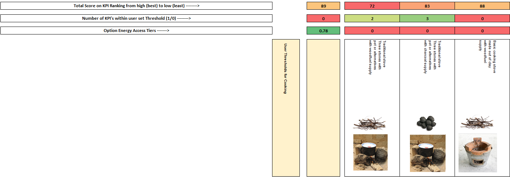
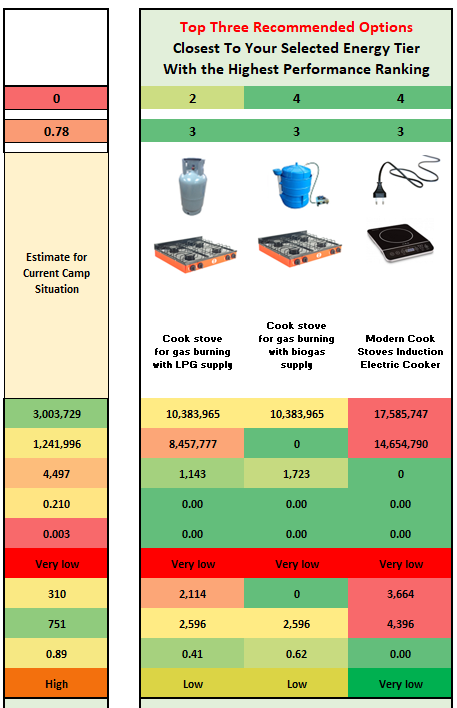

# Energy Access Tiers, Threshold Grouping & Ranking Calculations

**Energy Access Tier Calculations**

After electricity demands for the current baseline are established as per the
calculations above, the current Energy Access Tiers are calculated (see ESMAP
(2015)[33]. The ESMAP energy access tiers framework defines different Energy
Access Tiers based on a series of tables/matrices. Five areas of energy access
are considered for households/families: electricity services, lighting, cooking,
heating, and street lighting.

The calculation in the RERT tool is carried out by comparison of the
distribution of energy use technologies/infrastructures for each area, and the
extent to which it matches with the first 3 tiers of energy access, using a set
of if-then matching rule, based on pre-estimated qualities that indicate whether
an option meets a particular tier. The if-then matching rules are defined at an
abstract level as:

$$
If\ for\ Energy\ option\ j\ service\ the\ service\ and\ availability\ is\ met\ for\ Tier\ X,\ \text{set\ the\ Energy\ Access\ Tier\ to\ X}
$$

$$
\ for\ the\ \%\ of\ the\ population\ using\ option\ j.
$$

After the current Energy Access Tiers are calculated, each potential technology
solution can be compared against the current baseline situation. To this end
each technology solution has been identified at which energy-access tier level
it can be rated in a pre-defined way, by assessing the performance capabilities
for that solution and how it fits with providing the related energy access tier.
For example, a gasifier cooking stove using pellet supply is ranked at energy
access tier 3 for cooking, given the limited time needed to acquire fuel (pellet
fuel is sold or provided directly), the minor amount of stove preparation time
in filling the stove and lighting it, less than 5 minutes, and the associated
low PM and carbon monoxide emissions. The approach allows the RERT tool to
identify which energy access tiers are associated with each solution, for
comparison and selection purposes.

The energy access tiers are in the tool related to a user selection of which
tier the solutions should attain, such that the three recommended options fit as
closest as possible to the required tier improvement. The user to this end can
select four options, Current Average Tier, Tier 1, Tier 2 or Tier 3 for the
solution requirement (see Figure 6).

**Figure 6.** An overview of the interface where Energy Access Tier Requirements
for the Technology Solutions are set by the user.

**Table 13.** Tiers of Household Energy Access based on ESMAP values. Source:
ESMAP (2015)[33]

|             | **Metric**                         | **Tier 1**                                              | **Tier 2**                                                       | **Tier 3**                                                                                                |
|-------------|------------------------------------|---------------------------------------------------------|------------------------------------------------------------------|-----------------------------------------------------------------------------------------------------------|
| Electricity | Services                           | Task lighting, phone charging                           | General lighting & phone charging & television & fan (if needed) | Tier 2 + ANY medium power appliances (refrigerator, air cooler, food processor, water pump, rice cooker). |
|             | Power                              | 3 Watts                                                 | 50 Watts                                                         | 200 Watts                                                                                                 |
|             | Capacity                           | 12 Wh                                                   | 200 Wh                                                           | 1 kWh                                                                                                     |
|             | Availability                       | 4 hours per day, 1 hour per evening                     | 4 hours per day, 2 hours per evening                             | 8 hours per day, 3 hours per evening                                                                      |
| Lighting    | Service per person                 | 1000 lumen hours per day                                | Electrical lighting                                              | Electrical lighting                                                                                       |
|             | Availability                       | \>4 hours per day                                       | \>4 hours per day                                                | \>8 hours per day                                                                                         |
| Cooking     | Fuel acquisition preparation time  | \<7 hours per week                                      | \<3 hours per week                                               | \<1.5 hours per week                                                                                      |
|             | Stove preparation time             | \<15 minutes per meal                                   | \<10 minutes per meal                                            | \<5 minutes per meal                                                                                      |
|             | PM2.5 Exposure (μg/m3)             | ≤800                                                    | ≤400                                                             | ≤170                                                                                                      |
|             | CO Exposure (mg/m3)                | ≤35                                                     | ≤25                                                              | ≤18                                                                                                       |
|             | Health Risk\*                      | Tentatively 60% higher long-term mortality than level 5 | Tentatively 45% higher long-term mortality than level 5          | Tentatively 30% higher long-term mortality than level 5                                                   |
| Heating     | Capacity                           | Personal space around individuals heated                | One or more rooms heated                                         | One or more rooms heated                                                                                  |
|             | Convenience / fuel collection time | 7 hours per week                                        | 3 hours per week                                                 | 1.5 hours per week                                                                                        |

\*Health risk is relative to tier 5 which is the “lowest level above which total
cardiopulmonary and lung cancer mortality increases in response to PM2.5

**Table 14.** Tiers of Community Energy Access based on ESMAP values. Source:
ESMAP (2015).[33]

|                 | **Metric**   | **Tier 1**                                | **Tier 2**                   | **Tier 3**                                      |
|-----------------|--------------|-------------------------------------------|------------------------------|-------------------------------------------------|
| Street lighting | Capacity     | 1 functional street lamp in neighbourhood | 25% of neighbourhood covered | 50% of neighbourhood covered with street lights |
|                 | Availability | 2 night hours / day                       | 4 night hours per day        | 50% of night hours per day                      |

**Calculating the three recommended options**

The aim of the three recommended option process is to select the **best scoring
options within the user selected energy access tiers**. To evaluate the three
recommended options a two-step procedure is provided. First, the scoring of each
technology solution across performance indicators is calculated. To do so a
relative ranking is made for each technology option. In case there are 16
options therefore there will be a scoring of 1 to 16 points (16 the highest, 1
the lowest).

In mathematical terms the ranking can be described as having a number of options
$$j = 1,2,\ldots,n\$$, with an integer value assigned based on the relative
quantitative ranking between options. The best indicator scoring received the
highest number, and the lowest indicator the lowest number. The total number of
points that can be awarded in case of 16 options and ten performance criteria is
therefore 160 points (16 x 10). See figure

**Figure 7.** Scoring of different solutions visible to technical users

In case of qualitative indicators a ranking value $$R_{j}$$ is assigned using a
value assignment depending on the number of categories within the indicators,
whereby:

$$R_{j} = \left\{ \begin{matrix} \frac{1}{8}\ \text{n\ \ \ }\text{if\
}\text{ranking\ is\ low\ \ \ \ \ \ \ \ }\  \\ \frac{4}{8}\text{n\ \ \ if\
r}\text{anking\ is\ medium} \\ \frac{7}{8}\text{n\ \ \ if\ r}\text{anking\ is\
high\ \ \ \ \ \ \ \ } \\ \end{matrix} \right.$$ (14)

And

$$R_{j} = \left\{ \begin{matrix} \frac{2}{16}\ \text{n\ \ \ }\text{if\
}\text{ranking\ is\ very\ low\ \ \ \ \ \ \ \ }\  \\ \frac{5}{16}\ \text{n\ \ \
}\text{if\ }\text{ranking\ is\ low\ \ \ \ \ \ \ \ \ \ \ \ \ \ \ \ \ \ \ \ \ } \\
\frac{8}{16}\text{n\ \ \ if\ r}\text{anking\ is\ medium\ \ \ \ \ \ \ \ \ \ \ \ \
} \\ \frac{11}{16}\ \text{n\ \ \ }\text{if\ }\text{ranking\ is\ high\ \ \ \ \ \
\ \ \ \ \ \ \ \ \ \ \ \ \ } \\ \frac{14}{16}\text{n\ \ \ if\ r}\text{anking\ is\
very\ high\ \ \ \ \ \ \ \ \ \ } \\ \end{matrix} \right.$$ (15)

Second, out of the ranking the options are selected that are at or closest to
the Energy Access Tier that is selected by the user (1, 2, or 3). The **best
scoring options within the selected energy access tier** are selected as the
**top three recommended** solutions (see Figure 8 below). The total scoring is
displayed as a ranking for each option alongside the results, so as to compare
between options within the recommended group and the non-recommended group of
options.

**Figure 8.** Top Three Recommended Options Result Example

**Threshold Ranking per Option**

In addition to selecting the energy access tiers and the ranking for option
performance the user also can select a series of minimum or maximum thresholds
for each performance indicator across cooking, household/family electricity &
lighting, and/or community/institutional lighting. The threshold gives a scoring
for a solution when it either surpasses or falls below an energy solution design
criteria.

A scoring of 0 or 1 is assigned to each performance criteria, such that if there
are 10 performance indicators like for cooking solutions, an individual solution
can at maximum have a score of 10, and at minimum a score of 0. This allows for
a ranking of how well each solution performs against each-other by user set
criteria. Eeach indicator thus has an equal weight.

The process is similar for quantitative and qualitative indicators, given that
qualitative indicators range from low to high, or from very low to very high.
Thereby a bigger or lower than comparison can be made to establish which binary
value to assign.

The ranking is displayed for each option so that the user can understand how
well each option performance based on the design needs. The ranking provides a
similar solution idea to the more precise performance ranking as explained
above. And helps users understand how well the options fit within their specific
camp solution needs.  
  